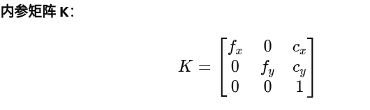
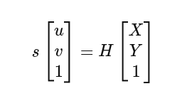
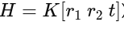
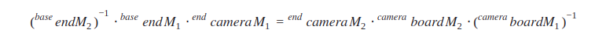
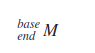
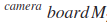
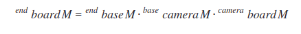

## 概述

* 手眼标定是将机械手和摄像机的坐标系统一起来，解决相机与机械手之间的坐标转换关系，让机械手能精确抓取到相机定位的目标。

* 当固定的相机和机械臂的相对位置发生变动时需重新进行手眼标定

  

### 代码结构 

    	image_collect.py  打开相机，按空格保存照片
    	
        eyeinHand.py  眼在手上，进行相机标定获取标定盘相对于相机坐标下的变换矩阵，通过cv内置库进行解算得到结果
        
        eyetoHand.py  眼在手外，进行相机标定获取标定盘相对于相机坐标下的变换矩阵，通过cv内置库进行解算得到结果
        
        poses.txt 记录末端相对于基座的位置，欧拉角

​         

### 环境准备

numpy

opencv-python

pyrealsense2

scipy

PyYAML

### 眼在手上

(1).标定板放置在平面上，相机固定在机械臂末端，相机对准标定板

(2).运行脚本`image_collect.py`，出现一个弹窗

(3).拖动机械臂末端，使呈现相机视野下的标定板清晰、完整、将光标放在弹窗上

(4).点击空格保存图片,并且记录此时的末端相对于基座的位置和欧拉角写在pose.txt里

(5).大角度移动机械臂，采集不同机械臂姿态下的标定板图片12-18张左右

(6).运行脚本`eyeinHand.py`，获取标定结果（相机相对于末端的R，t）

### 眼在手外

将标定板固定在末端上，固定相机

重复上述操作，最后(6)运行脚本`eyetoHand.py`即可得到结果（相机相对于base的R，t）

### 注意

* 移动机械臂末端旋转轴，**每次旋转的角度尽量的大（大于30°）**
* 标定板使用的是棋盘格，注意**参数**修改
* 相机使用的分辨率是1280*720

## 原理

#### 相机标定

* 在进行手眼标定时，首先进行了相机的标定，以获取相机的外参，同时可以获得相机的内参，畸变系数

  

**1.相机参数（**分辨率，内外参，畸变系数）

* 分辨率：相机采集图像的宽度和高度

* 内参：描述相机从三维世界到二维图像投影的几何关系

* 外参：描述相机坐标相对于其他坐标系的姿态，外参由 **旋转矩阵 R** 和 **平移向量 t** 构成

* 畸变系数：D = [k1,k2,p1,p2,k3]

**2.相机标定的原理**

* 
*  **利用棋盘格的已知三维几何坐标和图像上检测到的二维像素坐标，通过最小化重投影误差，反求出相机的内参、畸变参数和外参。**

**3.相机标定的流程**

(1).可以通过棋盘格的图片找到角点，得到角点关于像素下的坐标u,v，角点关于 棋盘格坐标下的实际位置Pw，通过上述公式可以得到H 

(2).利用 r1与 r2正交且范数相等的性质，可以得到关于 K 的线性约束，从而计算出内参K

(3).从 K 和 H 得到外参 R,t

(4).根据上述已知条件解算出畸变参数

得到的R，t 是棋盘格相对于相机坐标系下的变换矩阵，即cv解算函数的一个输入，另一个输入是末端相对于base的变换矩阵

#### 眼在手上标定

* 
* 因为board在base坐标系下的位姿是固定不变的，可以在不同的机械臂位置下表示，移项得：
* 
* 这是一个典型的**AX=XB**问题，解出X（相机在end下的位姿），标定完成
* 

​	通过机械臂API获取

* 

  相机标定得出，即相机标定的 R,t 组成变换矩阵

#### 眼在手外标定

* 
* 
* 除表示的变换矩阵不一致，其他和眼在手上标定一致

